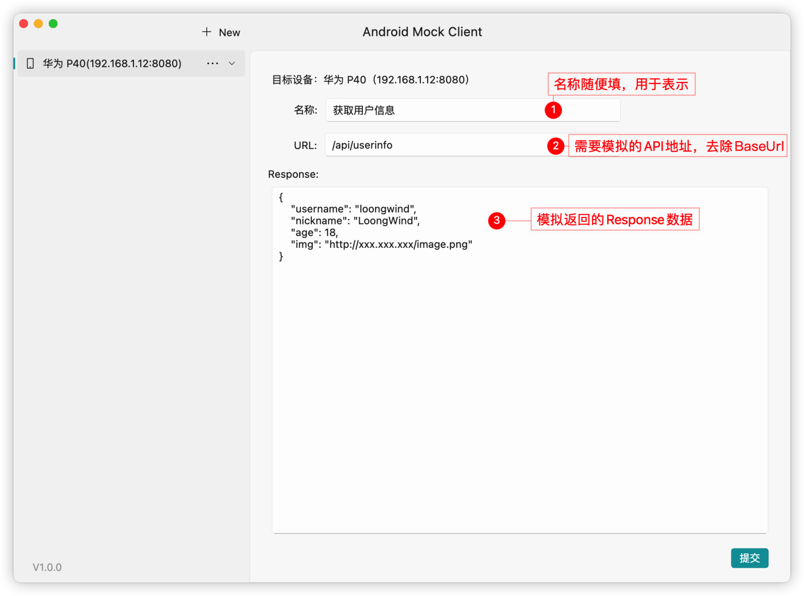

# mock_client

一个用于 Android Mock API 请求数据的客户端

整体预览效果：


该框架分为两部分，服务端和客户端，这里的服务端并不是 API 的后台服务，而是接收 Mock 数据的服务，集成到我们的 Android 程序中；客户端为管理 Mock 数据的 PC 程序，支持 Macos、Windows、Linux。

## Getting Started

### 集成 MockServer

在需要使用到 Mock 的 Android 项目中添加 Mock 的依赖库，然后进行简单的初始化就可快速集成 MockServer。

> 目前 MockServer 只支持对 OKHttp 的请求进行数据模拟

#### 添加依赖
在 module 的 build.gradle 中添加 MockServer 依赖：

```groovy
dependencies {
	implementation 'com.loongwind.ardf:mock:1.0.0'
}
```

#### 初始化

在项目的 Application 中或者使用 Http 请求之前进行 MockServer 的初始化，初始化代码如下：

```kotlin
MockServer.init(context = context, enable = true, enableCache = false)
```

初始化方法有三个参数：

- **context**：Android 的上下文，建议穿 ApplicationContext
- **enable**：是否开启 Mock，默认是 true，可以通过 `BuildConfig.DEBUG�`来控制 debug 时开启，release 时关闭
- **enableCache**：是否启用缓存，默认是 false，不会缓存配置的 Mock 数据，开启缓存后会本地缓存配置的 Mock 数据，下次启动会自动应用，适用于 Mock 启动时就需要访问的接口数据。

#### 添加 OKHttp 拦截器

初始化后还需要给 OKHttp 添加 MockServer 的拦截器，MockServer 库提供对应的扩展方法，使用如下：

```kotlin
val okHttpClient = OkHttpClient.Builder()
    // 扩展方法，用于添加 MockServer 的拦截器
    .addMockInterceptor()
    .build()
```

到这里在 Android 代码中集成 MockServer 就完成了，然后运行 APP 到设备上，等待结合客户端的使用。

### 使用 MockServer 客户端
首先在项目的 [Github Release ](https://github.com/loongwind/android_mock_client/releases) 中下载最新客户端，根据自己的系统选择下载对应的版本，如下图：


下载后进行安装，打开后客户端界面如下：


没错，就是一篇空白...，问题不大，点击 `New`添加需要 Mock 的设备：


名称随便填，地址填写你设备的 ip 地址，端口默认为 8080，比如：`192.168.1.12:8080`，然后点击确定：


然后点击右边的加号创建 Mock 数据：



填写完成后点击提交即可在对应设备下显示，如下：


在该页面可对 Mock 数据进行修改；可开启、关闭 Mock，可针对整个设备开启关闭也可针对某一个接口进行开启关闭。

> 需要电脑跟设备在同一局域网才可进行数据的 Mock
